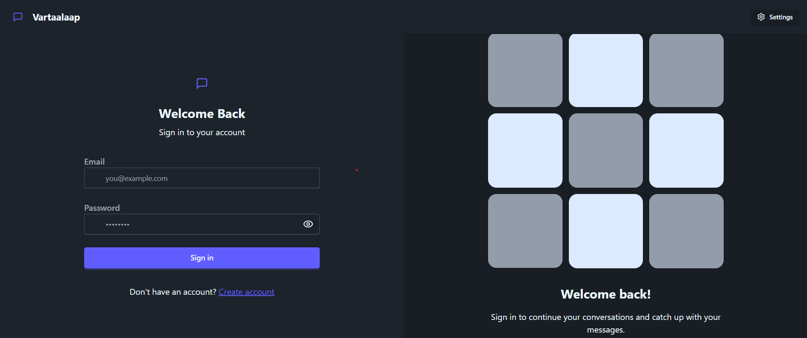
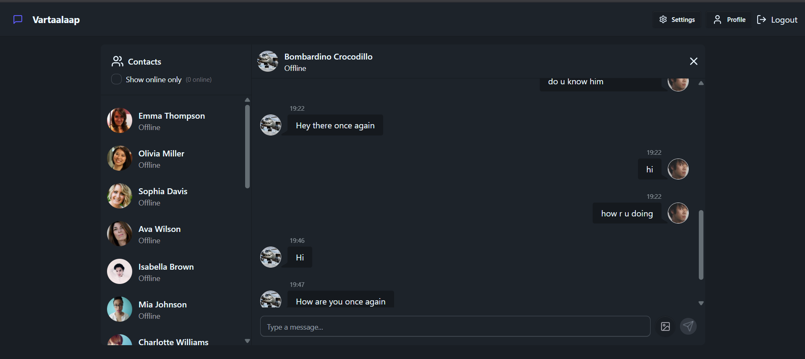

# 💬 Real-Time Chat Application

A full-stack real-time chat application built with the **MERN stack**, **Socket.io**, **Zustand**, **Cloudinary**, and styled using **Tailwind CSS** with **DaisyUI**. The app supports real-time messaging, JWT-based authentication, profile picture uploads, and a clean UI for seamless user experience.

---

## 📸 Preview




> 📁 Actual screenshots 

---

## 🚀 Features

- 🔐 JWT Authentication (Signup/Login/Logout)
- 🧠 Zustand for state management
- 💬 Real-time communication via Socket.io
- 📸 Profile picture upload using Cloudinary
- 🧭 Protected routes for authenticated users
- 🎨 Modern UI with TailwindCSS & DaisyUI
- ☁️ Deployed on Render with monorepo support

---

## 🛠️ Tech Stack

### Frontend
- React + Vite
- TailwindCSS + DaisyUI
- Zustand
- Axios
- Lucide React Icons

### Backend
- Node.js + Express
- MongoDB + Mongoose
- Socket.io
- Cloudinary
- JWT + bcrypt

---

## 📁 Folder Structure

```bash
RealTimeChatApp/
├── backend/
│   ├── controllers/
│   ├── routes/
│   ├── models/
│   ├── middleware/
│   └── index.js
├── frontend/
│   ├── src/
│   │   ├── components/
│   │   ├── pages/
│   │   ├── store/
│   │   └── App.jsx
│   └── vite.config.js
├── shared/
├── .env
└── package.json
```

---

## ⚙️ Setup Instructions

### Prerequisites

- Node.js
- MongoDB (local or Atlas)
- Cloudinary account (for image uploads)

---

### 1. Clone the repository

```bash
git clone https://github.com/UmangBarewar/Internship_Proj.git
cd Internship_Proj
```

---

### 2. Backend Setup

```bash
cd backend
npm install
```

Create a `.env` file in `backend/`:

```env
PORT=5001
MONGO_URI=your_mongodb_uri
JWT_SECRET=your_jwt_secret
CLOUDINARY_CLOUD_NAME=your_cloud_name
CLOUDINARY_API_KEY=your_api_key
CLOUDINARY_API_SECRET=your_api_secret
```

Start the server:

```bash
npm start
```

---

### 3. Frontend Setup

```bash
cd ../frontend
npm install
npm run dev
```

---

## 🌐 Deployment

- ✅ Monorepo deployed to [Render](https://render.com/)
- ✅ Backend serves `frontend/dist` in production

**Render Build Command (Root):**

```bash
npm install --prefix backend && npm install --prefix frontend && npm run build --prefix frontend
```

**Render Start Command:**

```bash
npm start --prefix backend
```

---

## 🔒 Environment Variables

Frontend `.env` (Vite):

```env
VITE_API_URL=https://your-backend-url.com
```

Backend `.env`:

```env
PORT=5001
MONGO_URI=your_mongodb_uri
JWT_SECRET=your_jwt_secret
CLOUDINARY_CLOUD_NAME=your_cloud_name
CLOUDINARY_API_KEY=your_api_key
CLOUDINARY_API_SECRET=your_api_secret
```

---

## 🧪 Testing

- ✅ Signup/Login flow
- ✅ WebSocket connections for messaging
- ✅ Profile picture uploads via Cloudinary
- ✅ Logout and route protection

---

## 🧠 State Management

Zustand is used to manage authentication, user state, and chat data efficiently.

---

## 🤝 Contributions

Feel free to fork the repo and submit a pull request!

---

## 📄 License

This project is licensed under the [MIT License](LICENSE).

---

## 📬 Contact

For any queries or feedback, feel free to reach out!

---

```

---

